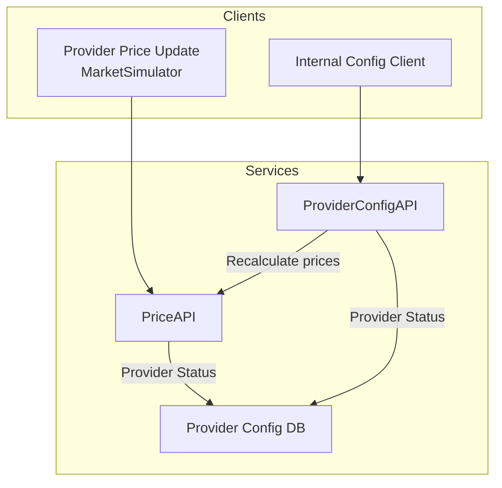
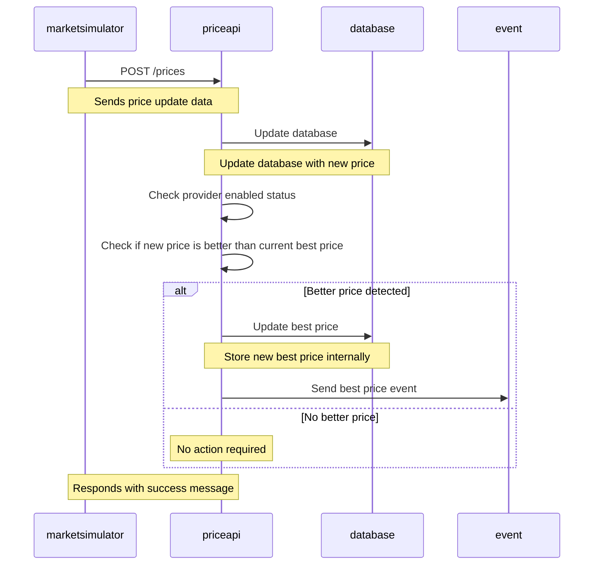
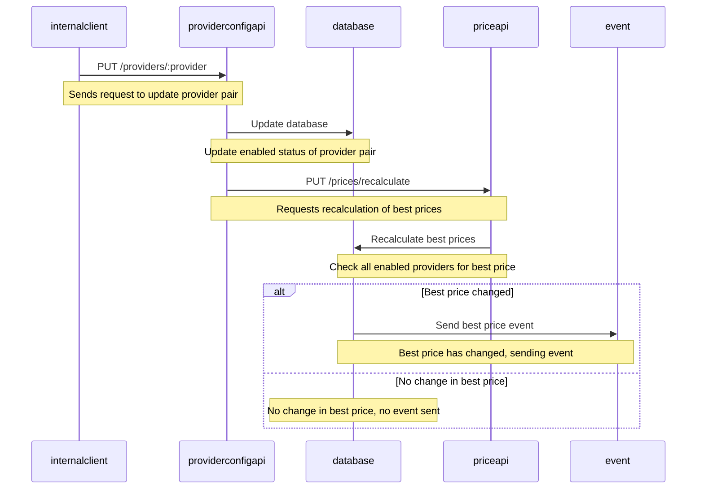
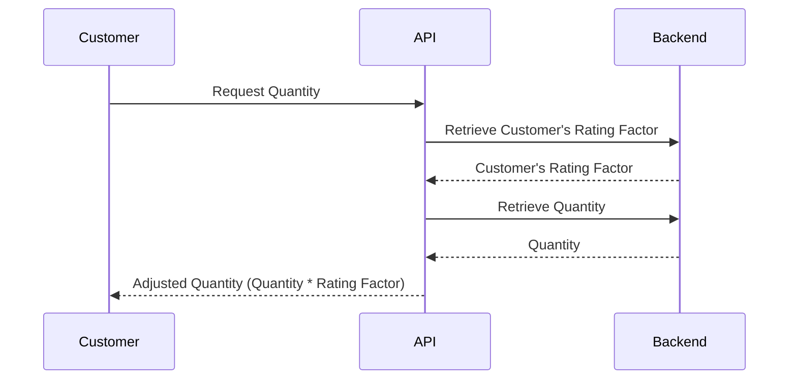
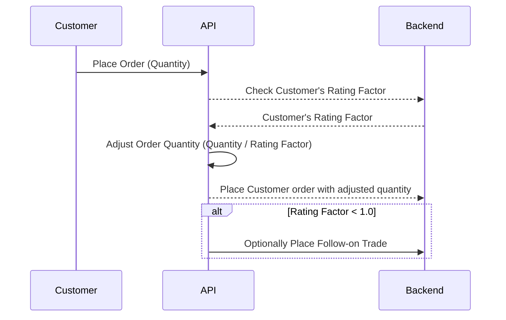

<!-- omit from toc -->
Chaos Theory Trial Project
==========================

<!-- omit from toc -->
## Introduction

This project addresses both tasks in the Chaos Theory practice problem provided.

<!-- omit from toc -->
## Table of Contents

- [Approach to Part 1](#approach-to-part-1)
  - [Quickstart](#quickstart)
  - [Design Considerations](#design-considerations)
  - [Microservices](#microservices)
  - [RESTful API](#restful-api)
    - [Example Usage](#example-usage)
- [Approach to Part 2](#approach-to-part-2)
  - [Quickstart](#quickstart-1)
  - [Customer Checks Quantity](#customer-checks-quantity)
  - [Customer Places an Order](#customer-places-an-order)
- [Improvements for real life situation](#improvements-for-real-life-situation)

## Approach to Part 1

### Quickstart

To run the all three services you can use the helper script, which simply builds and runs the docker-compose.yml file. This will launch three services and connect them together. This is the preferred method but takes a few minutes to build the docker images and run the services. The example will run autonmously with continuous updates.

```bash
# Run with simulator pushing continuous updates
./rundemo_part1_with_simulator

# Run without simulator (can use the ./scripts/provider_price_update script to send price updates manually)
./rundemo_part1_without_simulator
```

Alternatively, you can run the servies seperately (note sqlite is used here so we need CGO_ENABLED=1 as a requirement for the driver used):

```golang
CGO_ENABLED=1 go run ./cmd/providerconfigapi &
CGO_ENABLED=1 go run ./cmd/priceapi &
CGO_ENABLED=1 go run ./cmd/marketsimulator
```

Tests are provided but are not necessary for the project (the tests were mostly generated by AI to help with development):
```golang
CGO_ENABLED=1 go test ./src/...
```

The provider database is stored in `./data/ProviderDB.sqlite` file (created upon start).

To view the price logs check the `./logs/best_prices.log` file.

### Design Considerations

The project is structured around API services and a market simulator client. The Market Simulator client generates sensible random prices and pushes updates to the PriceAPI.

The microservice architecture was chosen to decouple services as much as possible, with only the database facilitating communication between them. An exception to this is the ProivderConfigAPI which sneds a REST request to the PriceAPI to reclaculate the prices. In practicse we would setup this trigger on the database itself, or via a pub/sub channel since the recalculation would get missed if the PriceAPI is not running.

While the project simplifies certain aspects, such as not storing the best ask or bid price in the database, in reality, these would be also stored. However, since these values aren't shared with other microservices, an in-memory approach suffices for this example.

As requested, enabled providers are randomized upon startup in the ProviderConfigAPI.

### Microservices

Below is a basic representation of the microservices. Generally the design follows a couple of rules:
- The PriceAPI is the only service to touch or calculate price based information (calculating best prices etc)
- The PriceAPI only performs read functions from the database to check provider status
- The ProviderConfigAPI is the only service to update provider enabled status in the database
- If a provider status is changed, the ProviderConfigAPI calls the PriceAPI to recalculate prices



The sequence diagram below illustrates the flow when a new provider price is pushed:



The following sequence diagram depicts the process when a provider is enabled/disabled via the ProviderConfigAPI:



### RESTful API

Two REST APIs are exposed:

***Price API***

- **POST /prices**: This route is used to receive price updates.
- **PUT /prices/recalculate**: Trigger a recalculation of the best bid and ask prices based on the current provider enabled/disabled settings.

**Provider API**

- **GET /providers**: Retrieve the list of providers and their currency pair enabled/disabled status.
- **GET /providers/:providerName**: Retrieve the enabled currency pairs for a specific provider.
- **POST /providers/:providerName**: Update the enabled currency pairs for a specific provider.

#### Example Usage

Helper scripts are provided in the ./scripts directory, these were used for testing. Ensure that the PricingAPI and ProviderAPI are running first before testing.

```bash
# list all provider pairs
./scripts/get_all_provider_pairs

# Get provider pairs for a specific provider
./scripts/get_provider_pairs GoldenDragonExchange

# Set provider pairs 
./scripts/set_provider_pairs GoldenDragonExchange BTC/USD/true ETH/USD/false

# Send a new price to the API
./scripts/provider_price_update GoldenDragonExchange BTC USD 54000.50 54100.75

# Force a recalculation of prices based on enabled/disabled providers
# NOTE: normally this is called automatically when enabling/disabling providers
./scripts/recalculate_prices

# Just show the current DB state
./scripts/show_sqlite_db
```

Or you can directly call the curl commands below:

```bash
# Get list of providers
curl -X GET http://localhost:8081/providers

# Get enabled currency pairs for a specific provider
curl -X GET http://localhost:8081/providers/DragonFlyExchange

# Update enabled currency pairs for a specific provider
curl -X POST -H "Content-Type: application/json" -d '{"pairs":[{"base":"BTC","quote":"USD","enabled":true},{"base":"ETH","quote":"USD","enabled":false}]}' http://localhost:8081/providers/DragonFlyExchange

# Send a new price update
curl -X POST -H "Content-Type: application/json" -d '{"Provider":"ExampleProvider","Base":"BTC","Quote":"USD","Bid":50000,"BidAmount":2,"Ask":50100,"AskAmount":3,"Timestamp":1648882862}' http://localhost:8080/prices
```

**Expected Data for POST /providers/:providerName**

When sending a POST request to update the enabled currency pairs for a specific provider, the expected data format should be in JSON and contain an array of objects, each representing a currency pair with its base currency, quote currency, and enabled status. Here's an example:

```json
{
  "pairs": [
    {
      "base": "BTC",
      "quote": "USD",
      "enabled": true
    },
    {
      "base": "ETH",
      "quote": "USD",
      "enabled": false
    }
  ]
}
```

## Approach to Part 2

### Quickstart

To run the ratingfactordemo, you can run the helper script:

```bash
# Run helper script
./rundemo_part1
# Or directly run with golang
go run ./cmd/ratingfactordemo
```

For Part 2, a demo application called "ratingfactordemo" illustrates a simple approach. It includes sample data showing different rating factors (0.8, 1.0, 1.2).

The application demonstrates how quantity adjustments are made based on the customer's rating factor. When retrieving quantity from the database, the quantity is multiplied by the rating factor. When placing an order, the quantity is divided by the rating factor.

Further diagrams to illustrate the flow are bloe

### Customer Checks Quantity



### Customer Places an Order



## Improvements for real life situation

I think in a real life situation, I might pull out some of the functions to be seperate microservices. For example I would add a pub/sub architecture and have the microservice listening on a topic for when providers are updated. Then a standalone function would perform the best price recalculations.

I would probably have the provider updates pushed to a pub/sub topic instead of a REST API. If a rest API was required (e.g. providers push updates to webhook) then I would have a service which just receives that and pushes it to a pub/sub topic. This setup makes it easy to test and improve pieces of the code at a time.

Furthermore, if I'm writing a REST API I would have much better error handling and would add OpenAPI documentation then it can be tested used something like Postman easily.